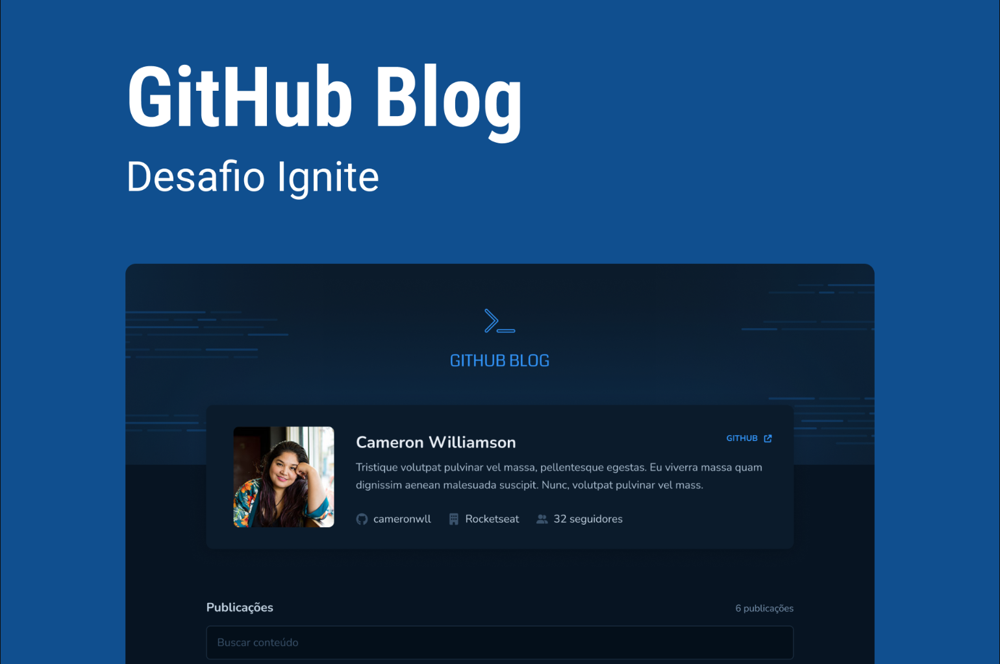

## Challenge 03 - Github Blog

During this challenge, we developed an application that uses the GitHub API to fetch issues from a repository, profile data and display it as a blog.

### 🛠️ Tools

* Vite
* Styled Components
* Typescript
* React Router Dom
* React Hook Form
* Axios
* API do Github